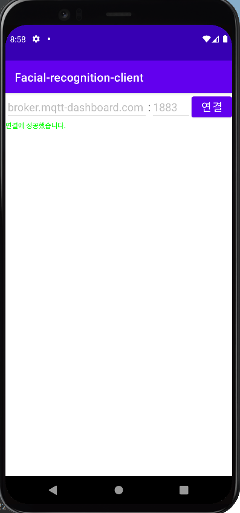
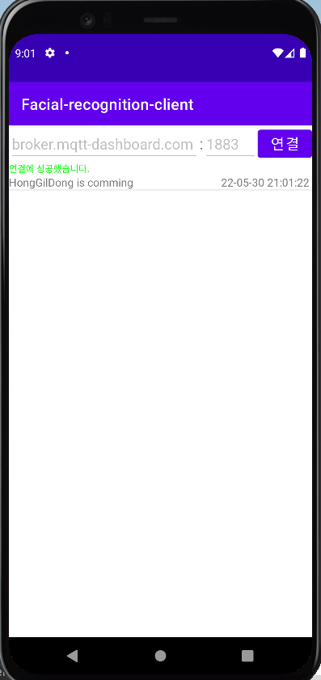
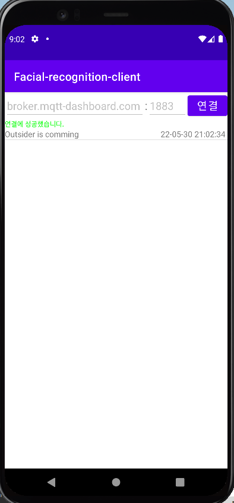

# Facial-recognition-model

    
    

MQTT Client

## Description
 - MQTT 라이브러리를 사용해 안면 인식 모델이 보낸 메시지를 수신합니다.

## Environment
 - 안드로이드
 - Kotlin
 - MQTT 라이브러리

## Screenshot
- 연결, 사용자 인식, 외부인 인식

    
    
    

## Working Process
1. 앱 실행.
2. 상단에 ip 주소와 포트번호를 설정하고 연결 버튼을 클릭합니다.
3. 바로 밑 "연결되었습니다."가 확인되면 메시지를 받을 수 있습니다.
4. 메시지는 list view로 수신 시 추가됩니다.