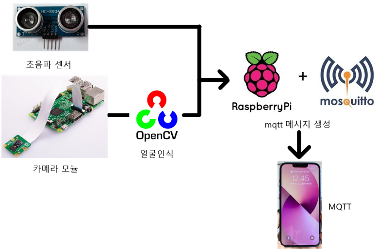
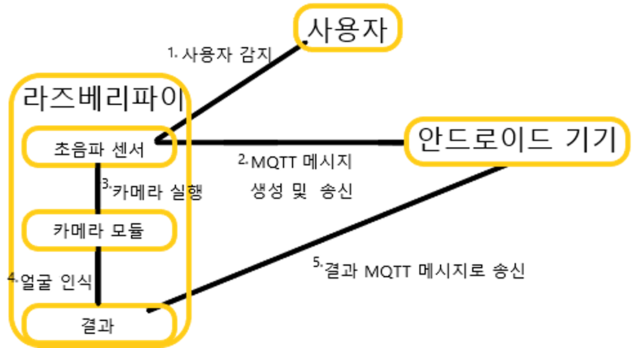
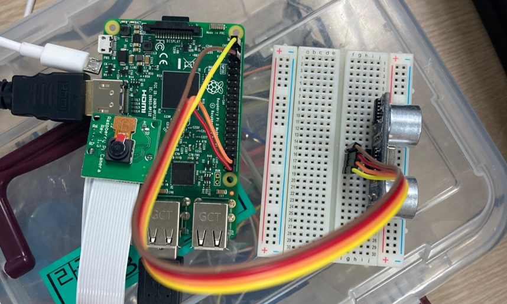
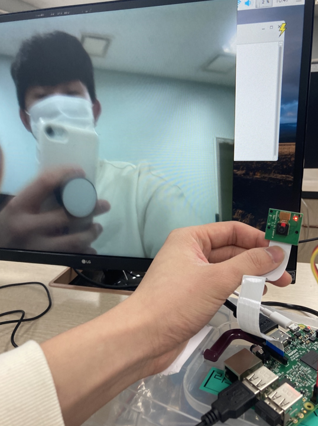
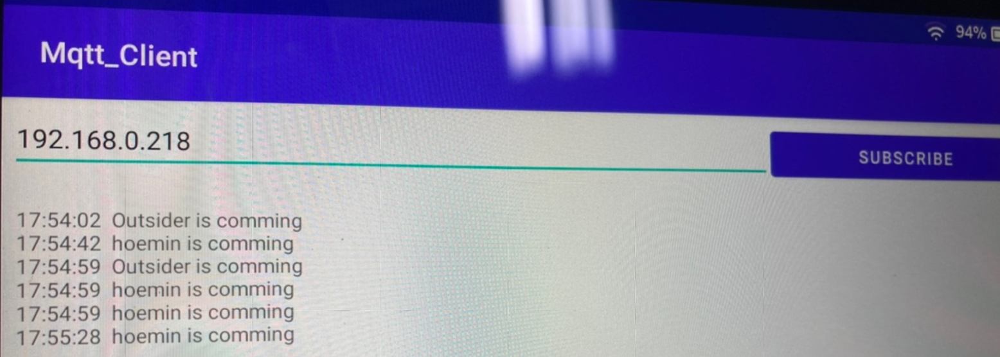

# Facial-recognition-system

<!-- 
    Custom badge form
    아이콘 확인 사이트: https://simpleicons.org/
    
 -->
    
    
    

라즈베리파이3를 이용한 사용자 안면 인식 출입 시스템 프로젝트

## Project Description
- EH 교과 개인 프로젝트 입니다.
- 라즈베리파이 카메라 모듈을 이용한 얼굴인식 기반 출입시스템입니다.
- 사람 얼굴이 인식되면 사용자인지 판단하고 결과를 앱으로 전송합니다.

## Project Architecture

## Screenshot

## Working Process
1. 라즈베리 파이에서 save_user.py를 실행해 다양한 각도로 사용자의 얼굴 사진 100장을 촬영하여 저장합니다.
2. 라즈베리 파이에서 make_model.py를 실행해 1번에서 저장된 사진들을 가지고 안면 인식 모델을 만듭니다.
3. 라즈베리 파이에서 start.py를 실행해 2번에서 만든 모델을 불러와서 대기합니다.
4. 대기 중에는 초음파 센서로 전방과의 거리를 측정해 누군가의 접근을 감지합니다.
5. 접근을 감지하면 카메라를 작동해 사용자의 얼굴을 가지고 등록된 사용자인지 외부인인지 판단합니다.
6. 등록된 사용자라면 사용자의 이름을, 외부인이라면 외부인임을 알리는 메시지를 mqtt 프로토콜을 이용해 안드로이드 앱에 전송합니다.
7. 이후 4번부터 다시 진행합니다.